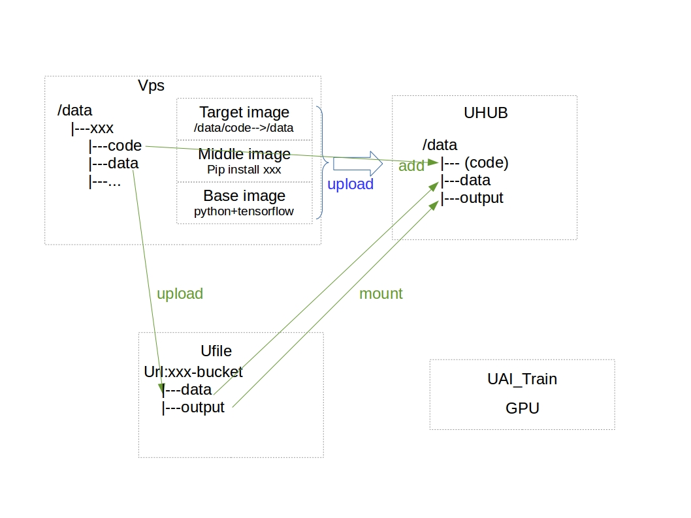

## Srcipts for uai_train
从设计上将,aitrain是个好东西,它具有一下优点  
1. 数据,代码,环境项目分离
2. 速度快,我们测试时速度是我们gpu的两倍
3. 可以同时跑多个任务
4. 可以分布式计算,不过工程师说这个功能还没有开放
但是按照官网的教程走一边,虽然能够跑通,但是很复杂,所以写了这些脚本来简化操作过程.

## uaitrian原理

有三个空间,分别是云主机,uhub,ufile.  
云主机是一个工作平台,我们在上面完成操作,其实在你自己的服务器上也行,但是它的云主机和uhub,ufile在同一个内网下,传输速度比较快.  
核心思想是, uhub提供一些基本镜像(python与tensorflow)的各种组合,基于此定制你自己的镜像(安装一些包),然后把代码也放进去.  
这样最终的镜像就包含了`开发环境`和`代码`  
所有输入数据存放在ufile中,里面的每个数据文件都有全局唯一的url.  
这样`开发环境`,`代码`,`数据`都有了.  
然后发起aitrain任务,选择镜像(`开发环境`+`代码`),选择输入数据,选择输出数据(会保存在ufile中),然后运行就可以了.  
可以理解为选择一个虚拟机, 插入一个u盘,虚拟机负责运行,输入数据来自u盘, 输出数据也存放到u盘

## 一些约束
方便的代价就是必须遵循一些潜规则,就是
> 代码中所有涉及到路径的参数,都用`FLAGS.data_dir`,`FLAGS.output_dir`, `FLAGS.log_dir`
比如把`"./data/input/data.txt"`改为`FLAGS.data_dir+"input/data.txt"`  
比如把`"./data/data.txt"`改为`FLAGS.data_dir+"/data.txt"`  
注意到这两个例子的区别了吗? 如果有层级的话,是不能加`/`的,如果是单个文件,是需要加的,尝试出来的.
所以你需要在你的代码中添加这两行:
```python
from uaitrain.arch.tensorflow import uflag
FLAGS = tf.app.flags.FLAGS
```
其中`uflag`实际上是定义了这三个变量对应的值  
```
FLAGS.data_dir  /data
FLAGS.output_dir  /data/output
FLAGS.log_dir  /data/output
```
他们值得是挂载到容器中后的路径,如果你想更加透彻的理解,请学习docker基础教程.

## 使用方式
如果你只想快速适用,那么按照这几步来就好.
1. `git clone git@github.com:lihao2333/TP_uai_train.git /data/` 
2. 在`~/.bashrc`中最后一行添加`source /data/TP_uai_train/uai_train.bashrc`,然后执行`source ~/.bashrc`
3. 执行`uai_gen xxx`, 会在`/data/xxx`处添加创建一个模板目录, `xxx`只是一个工程名,建议不要有数字
4. 把你的代码放到`/data/xxx/code/中`, 把你的数据放到`/data/xxx/data`中
5. `cp /data/xxx/code/configall.sh_demo /data/xxx/code/configall.sh`,然后按照注释修改`/data/xxx/code/configall.sh`文件,主要是输入你的个人信息和一些命名
6. 执行`/data/xxx/prepare_images.sh` 自动制作镜像并且上传,在[这里](https://console.ucloud.cn/uhub/uhub/user_image)可以查看
7. 执行`/data/xxx/prepare_data.sh` 自动将`/data/xxx/data`里面的数据上传, 在[这里](https://console.ucloud.cn/ufile/ufile/manage/normal)可以查看
8. 执行`/data/xxx/train.sh  yyy`  自动开启训练任务,`yyy`为注释,在[这里](https://console.ucloud.cn/uaitrain/manage)可以查看

## 修改参数
如果你把`/data/xxx/code/`中的代码进行了修改, 你只需要再次执行`/data/xxx/prepare_images.sh`重新制作镜像,然后执行`/data/xxx/train.sh yyy`就可以

## 高阶用法
你可以`uai_gen xxx`创建多个工程, 并且可以同时运行多个任务.
