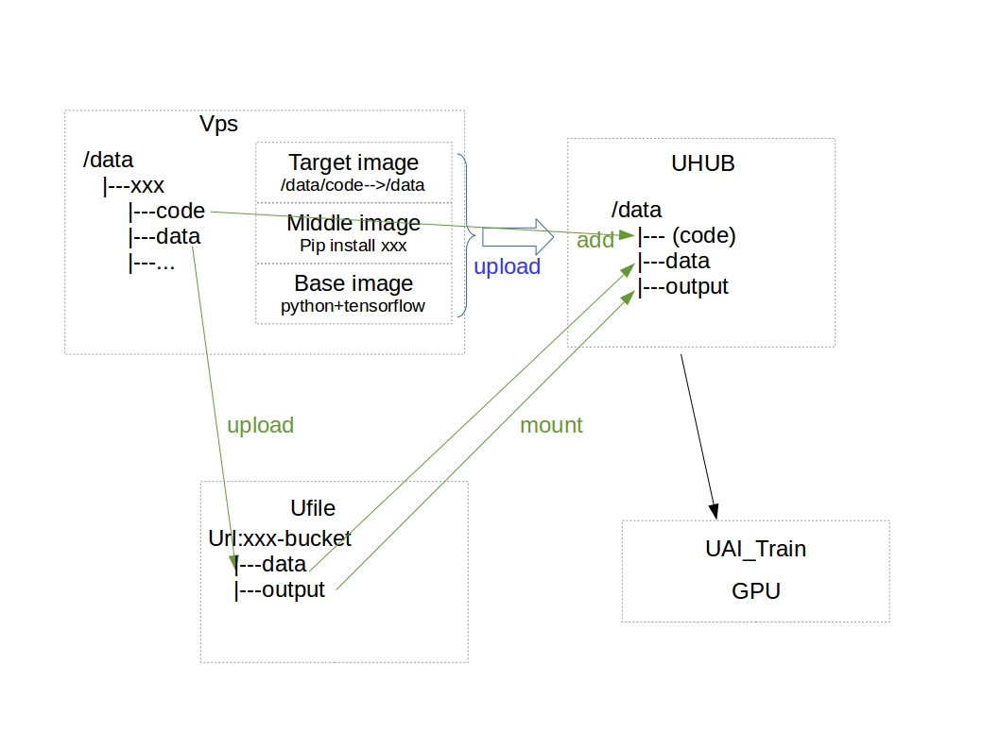

## Srcipts for uai_train
从设计上将,aitrain是个好东西,它具有一下优点  
1. 数据,代码,环境项目分离
2. 速度快,我们测试时速度是我们gpu的两倍
3. 可以同时跑多个任务 
4. 可以分布式计算,不过工程师说这个功能还没有开放  
但是按照官网的教程走一边,虽然能够跑通,但是很复杂,所以写了这些脚本来简化操作过程.

## uaitrian原理

有三个空间,分别是云主机,uhub,ufile.  
云主机是一个工作平台.  
UHUB是镜像空间，　每个镜像包含了`开发环境`和`代码`  , 
UFILE是文件空间，　 每个bucket包含了`数据`,   
在调用aitrain任务的时候，　将bucket挂载到镜像中，执行预定义的命令就好了．

比较复杂的是用docker 制作镜像，经历如下3步:
1. base镜像:uhub提供了一些基本镜像，是各种python和tf的组合
2. middle镜像:在base 的镜像执行一些命令，比如用pip安装包
3. target镜像: 把代码也加到镜像当中.

每个镜像都有`cpu`,`gpu`两个tag, `cpu`仅用于本地测试, `gpu`是真正放到训练节点上去的

## 使用方式
如果你只想快速适用,那么按照这几步来就好.
1. `git clone git@github.com:lihao2333/TP_uai_train.git /data/TP_uai_train;cd /data/TP_uai_train` 
2. `cp ./configall.sh_demo ./configall.sh`,然后按照注释修改`./configall.sh`文件,主要是输入你的个人信息和一些命名
3. 在`./edit_image_cmd.txt` 写入修改镜像的命令
4. 在`~/.bashrc`中最后一行添加`source /data/TP_uai_train/uai_train.bashrc`,然后执行`source ~/.bashrc`
5. 执行`uai_gen xxx`, 会在`/data/xxx`处添加创建一个模板目录, 并且进入.`xxx`只是一个工程名,建议不要有数字
6. 把你的代码放到`./code/中`, 把你的数据放到`./data`中
7. 执行`./prepare_images.sh` 自动制作镜像并且上传,第一次使用的话，需要登录，就是你登录控制台的用户名和密码，在[这里](https://console.ucloud.cn/uhub/uhub/user_image)可以查看
8. 执行`./prepare_data.sh` 自动将`./data`里面的数据上传, 在[这里](https://console.ucloud.cn/ufile/ufile/manage/normal)可以查看
9. 执行`./train.sh  yyy`  自动开启训练任务,`yyy`为注释,在[这里](https://console.ucloud.cn/uaitrain/manage)可以查看

## 修改参数
如果你把`./code/`中的代码进行了修改, 你只需要再次执行`./prepare_images.sh`重新制作镜像,然后执行`./train.sh yyy`就可以

## 高阶用法
你可以`uai_gen xxx`创建多个工程, 并且可以同时运行多个任务.
